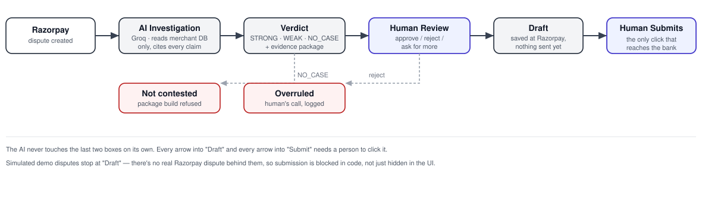
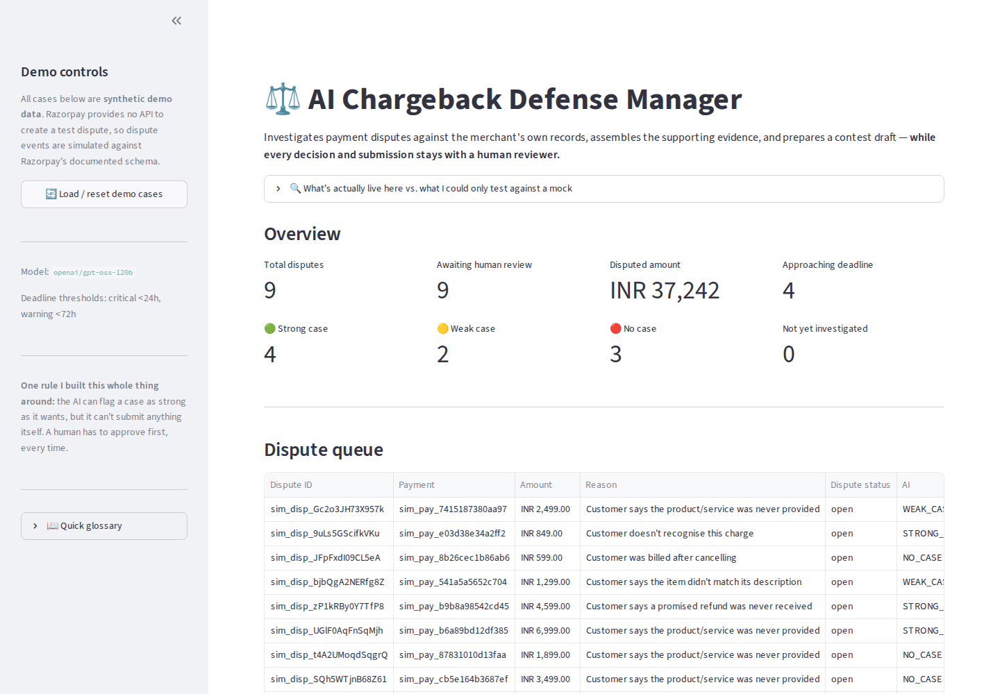
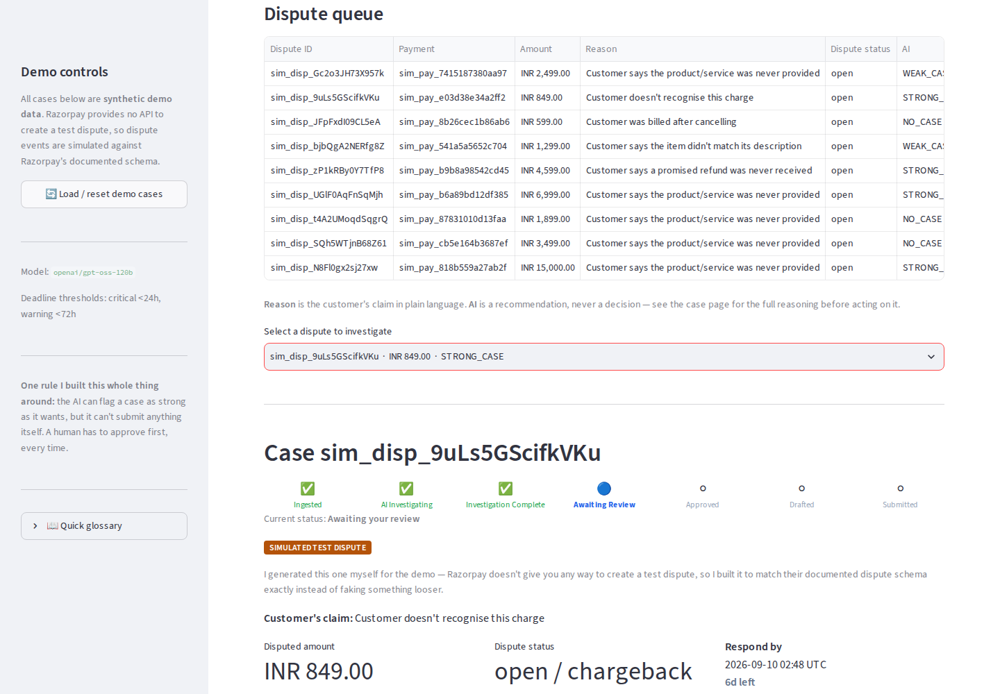
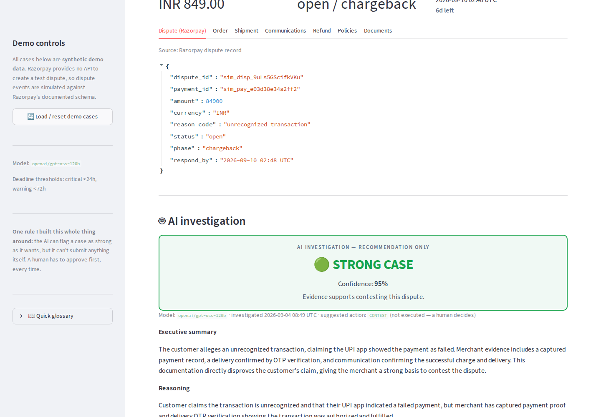
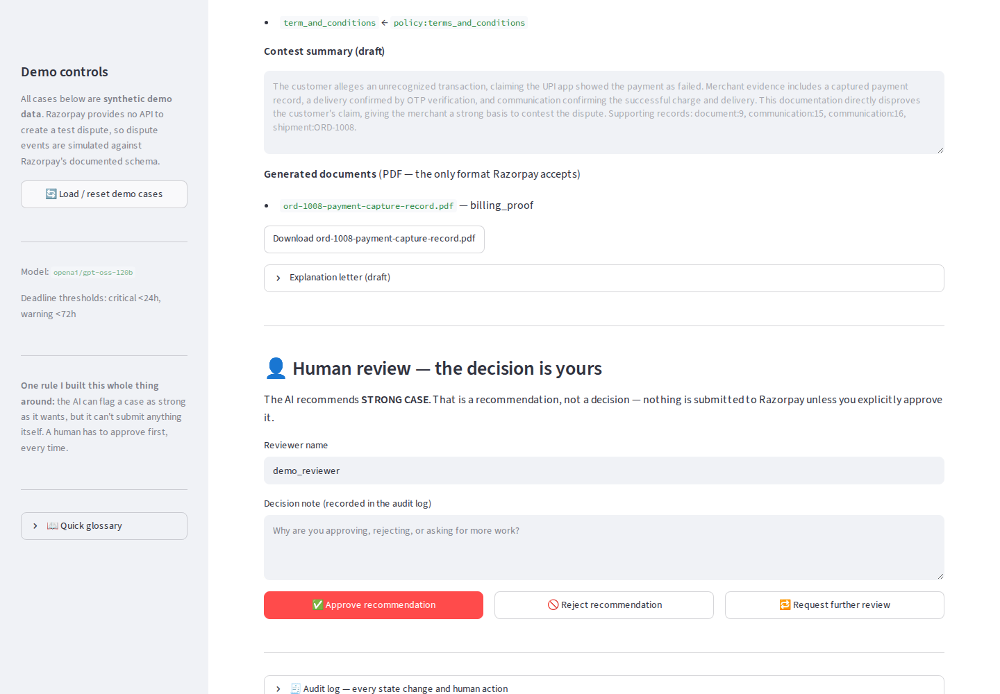
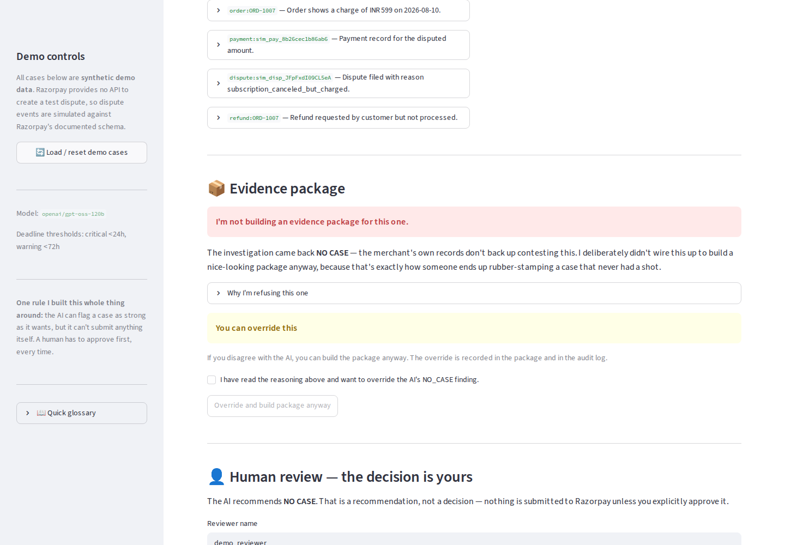

# AI Chargeback Defense Agent

**Razorpay AI Buildathon — Track 2: AI Risk Manager**



## Hi, I'm Abiram

I picked Track 2 — stop merchants bleeding money to fraud, returns and
chargebacks — because the numbers on the ground in India don't match the
textbook chargeback story:

- **UPI is ~85% of India's digital payment volume now** (NPCI, FY 2025-26,
  554M+ users, 65M+ merchants). Most disputes I'd actually see aren't "stolen
  card" — they're a UPI app showing *failed* while the money genuinely left.
- **Indian D2C sellers run RTO rates of 25–35%**, against an 8–12% global
  benchmark, at roughly ₹150–300 lost per returned order. That's a bigger
  drain than card fraud for most merchants here.
- Globally, every **$1** a merchant loses to a chargeback costs them **$5.13**
  all-in once you count fees, lost goods and admin time (LexisNexis, *True
  Cost of Fraud* 2026) — and ~74% of disputes that get raised go all the way
  to a full chargeback rather than getting resolved earlier.

So the problem isn't "detect fraud" — Razorpay already does that. The problem
is: once a dispute exists, someone has to dig through order systems, courier
tracking and support chats, decide fast (there's a hard deadline), and get it
right in both directions — don't contest what you'll lose, don't give up on
what you'd win. That's slow, manual, and easy to get wrong under pressure.
That's what I built this to fix.

## How I'm solving it

```
Razorpay dispute → AI reads the merchant's own records → verdict + evidence
   → human approves/rejects → draft → human submits → Razorpay → bank
```

The AI never acts alone. It reads real records (never invents anything —
every claim it makes has to point at an actual row in the database or it
gets rejected), and hands a human a recommendation, not a decision. Nothing
gets drafted, and nothing gets submitted, without someone clicking to make
it happen.

Razorpay gives no one — not me, not any merchant — a way to spin up a test
dispute, so the demo dispute events are simulated to match Razorpay's real
dispute schema exactly, clearly labelled as such everywhere they appear.
Full story on that, and everything else, in [ARCHITECTURE.md](ARCHITECTURE.md).

## What I built

| Phase | What | Status |
|---|---|---|
| 1 | Real Razorpay Test Mode integration | ✅ |
| 2 | Dispute ingestion — real webhook + labelled simulator | ✅ |
| 3 | Merchant database + 9 realistic dispute scenarios | ✅ |
| 4 | AI investigator — Groq, every citation checked against real data | ✅ |
| 5 | Evidence builder — PDFs, Razorpay's evidence categories | ✅ |
| 6 | Human review dashboard | ✅ |
| 7 | Contest draft → human-gated submit to Razorpay | ✅ |
| 8 | Held-out evaluation — precision/recall/F1, ₹ impact | ✅ |
| 9 | Failure-mode demo | ✅ |
| 10 | Polish | ✅ |

223 tests, all passing. Every real bug I hit along the way — and a few I
almost shipped — is written up in [BUILD_LOG.md](BUILD_LOG.md), not swept
under the rug.

## Does it actually work?

I built a 200-case labelled dataset and held 50 of them back. Results on the
**held-out set** (`openai/gpt-oss-120b`, 50 cases, 100% coverage, zero
crashes):

| Metric | Score |
|---|---|
| **Precision** | **1.000** |
| **Recall** | **0.967** |
| **F1** | **0.983** |
| Accuracy | 0.980 |
| False-positive rate | **0.000** — never once told the merchant to contest a case it couldn't win |
| False-negative rate | 0.033 — one winnable case it wanted to drop |

```
             predicted contest    predicted drop
 defensible        29 ✅                1 ⚠️
 indefensible       0 ✅               20 ✅
```

**The zero false-positive rate is the number I care most about.** A false
positive means telling a merchant to spend time and money contesting a case
their own records can't support — actively harmful advice. It got that
direction right 20 out of 20 times, including every never-shipped,
RTO-unrefunded and charged-after-cancellation case.

**The one miss is honest, and arguably mine not the model's.** It was a
partial-refund case: item delivered, one component faulty, merchant refunded
30% in good faith, customer disputed the full amount. I labelled it defensible
(delivery is proven, the refund was made). The model said don't contest,
because the merchant had *admitted* the defect — so on the specific claim
raised (`not_as_described`), the merchant's own records partly back the
customer. That's a defensible reading of a genuinely borderline case.

**What these numbers do and don't mean.** They measure whether the model
reasons correctly over evidence, on cases where I planted the facts and the
answer key together — so the ground truth is trustworthy, but it's synthetic.
This is not a claim about real-world dispute outcomes, and it never could be:
the issuing bank decides those, and I have no win-rate data. For the same
reason the financial figures below say *defended*, not *recovered*.

| Financial exposure (held-out set) | Amount |
|---|---|
| Put forward for contest (correctly) | ₹97,321 |
| Wrongly contested | ₹0 |
| Winnable, but dropped | ₹6,999 |
| Correctly dropped | ₹67,430 |
| Cost to run the AI over all 50 | ₹250 |
| Reviewing all 50 by hand instead | ₹12,500 |

Cost figures are assumptions from `src/config.py`, not published Razorpay
fees — I left the chargeback penalty deliberately unset rather than invent one.

Reproduce it:

```bash
uv run scripts/run_evaluation.py --split holdout    # resumable, rate-limit paced
uv run scripts/run_evaluation.py --split holdout --report   # metrics, no API calls
```

The run takes ~25 minutes — not because it's slow, but because Groq's free
tier allows ~8,000 tokens/minute and 50 cases is ~125,000 tokens. It paces
itself under that limit, checkpoints every case, and resumes exactly where it
stopped if you Ctrl-C it.

## Does it fail safely?

Yes — `scripts/demo_failures.py` deliberately breaks 8 real things and shows
the system refuse to do the wrong one:

```bash
uv run scripts/demo_failures.py
```

```
1. Razorpay auth failure       -> no fabricated data, no crash, secret never shown
2. Tampered webhook signature  -> rejected before JSON is even parsed, nothing ingested
3. Duplicate webhook delivery  -> processed once, retry acknowledged and ignored
4. AI transient failure        -> real backoff/retry recovers automatically
5. Malformed AI output         -> rejected every attempt, no fake verdict persisted
6. Missing merchant evidence   -> fails safe before even asking the model
7. Oversized contest summary   -> refused locally, before any network call
8. Expired dispute deadline    -> blocked at the backend, not just a UI banner

SUMMARY: 8/8 failure scenarios handled safely
```

Every scenario runs the real application code — the webhook handler, the
investigation agent, the contest service — against a throwaway temp
directory. Only the true external boundary is mocked (the Razorpay SDK call,
the Groq call), so this isn't 8 isolated unit tests, it's one script proving
the whole safety story end to end. It also verifies the real
`data/merchant/*.db` files are untouched by the run.

**One real bug this caught**: an invalid-signature webhook attempt used to
permanently block a *later, genuinely valid* delivery of the same body — an
attacker's replay (or our webhook secret being briefly wrong during a
rotation) could silently drop a real dispute forever. Fixed — see
[BUILD_LOG.md](BUILD_LOG.md) 2026-09-05-01.

## See it running

**Overview — every case, AI verdict, and deadline at a glance:**


**Open a case — workflow stepper, provenance badge, full merchant evidence:**


**The AI's verdict — recommendation only, every claim traceable to a record:**


**Evidence package + human review — nothing moves without a click:**


**NO_CASE — package-building refused; override needs an explicit checkbox:**


## Setup & run

```bash
uv venv --python 3.12
uv pip install -r requirements.txt
cp .env.example .env      # paste your 4 keys - table below
uv run run.py              # seeds demo data + launches the dashboard
```

Open **http://localhost:8501**. First run seeds and AI-investigates 9 cases
(~2 min); every run after skips straight to the dashboard. `Ctrl-C` stops
everything — it's one process, nothing lingers. `uv run run.py --reset` to
rebuild the demo data.

| Variable | Where to get it |
|---|---|
| `RAZORPAY_KEY_ID` | Razorpay Dashboard → Test Mode → Settings → API Keys |
| `RAZORPAY_KEY_SECRET` | shown once when you generate the key |
| `RAZORPAY_WEBHOOK_SECRET` | the secret on your webhook endpoint |
| `GROQ_API_KEY` | console.groq.com/keys |

## Read more

- [ARCHITECTURE.md](ARCHITECTURE.md) — full technical writeup, phase by phase
- [BUILD_LOG.md](BUILD_LOG.md) — real problems I hit and how I fixed them
- [NOTES.md](NOTES.md) — the detailed engineering log
